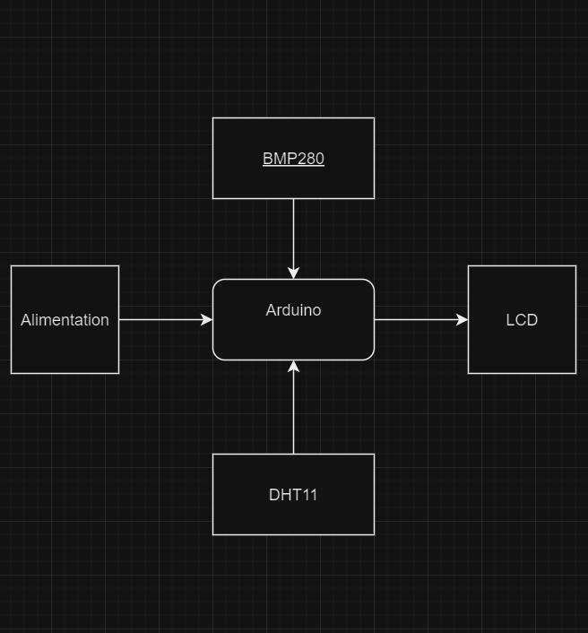
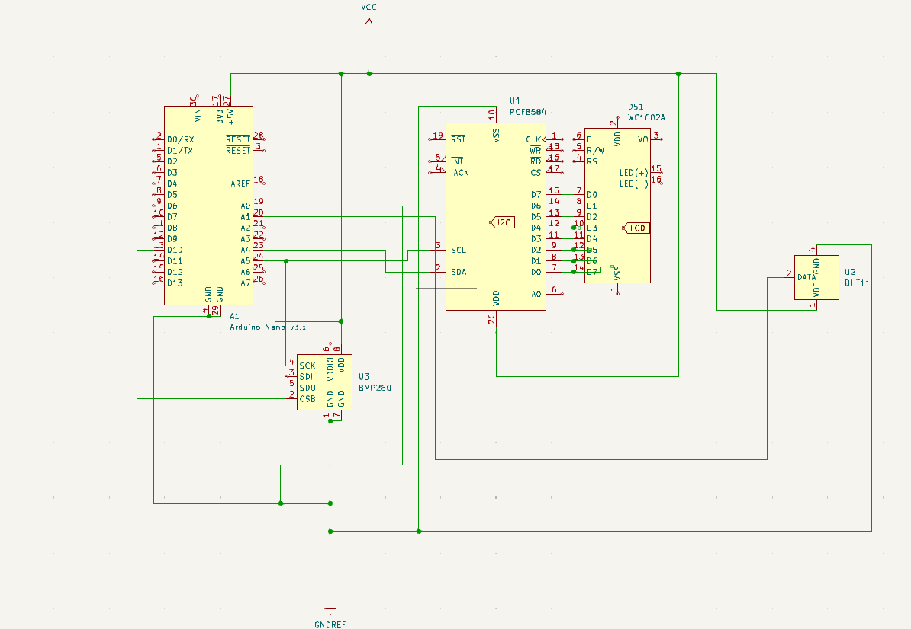

# Station meteo

| | |
|-|-|
|`Author` | Mpouassa Dalia Gesca

## Description
Station météo intelligente : elle mesure en temps réel la température, l'humidité et la pression atmosphérique, puis affiche ces données de manière claire sur un écran.
## Motivation

Ce projet de station météo répond au besoin d’obtenir des données climatiques locales et fiables. En mesurant la température, l’humidité et la pression, il permet une meilleure compréhension de notre environnement.
## Architecture
La station météo s’articule autour de trois composants principaux :

Un thermomètre, chargé de mesurer la température ambiante.

Un capteur barométrique, qui relève la pression atmosphérique.

Un écran d’affichage, qui présente en temps réel les données relevées.

Ces capteurs sont connectés à une carte Arduino, servant de microcontrôleur central. Elle collecte les données mesurées, les traite, puis les transmet à l’écran pour une visualisation claire et instantanée.
### Block diagram

<!-- Make sure the path to the picture is correct -->

### Schematic

### Components

<!-- This is just an example, fill in with your actual components -->

| Device | Usage | Price |
|--------|--------|-------|
| Arduino  | Plaque de base  | [25 RON](https://www.optimusdigital.ro/ro/compatibile-cu-arduino-nano/1686-placa-de-dezvoltare-compatibila-cu-arduino-nano-atmega328p-i-ch340.html?search_query=Arduino+Nano&results=22) |
| Ecran | Affiche | [17 RON](https://www.optimusdigital.ro/ro/optoelectronice-lcd-uri/2894-lcd-cu-interfata-i2c-si-backlight-albastru.html) |
| Thermometre  | detecte la temperature | [7 RON](https://www.optimusdigital.ro/ro/senzori-senzori-de-temperatura/584-senzor-de-temperatura-dht11.html?search_query=dht11&results=17) |
| Capteur pression | detecte la pression | [9 RON](https://www.optimusdigital.ro/ro/senzori-senzori-de-presiune/1666-modul-senzor-de-presiune-barometric-bmp280.html) |
| Breadboard | Project board | [10 RON](https://www.optimusdigital.ro/ro/prototipare-breadboard-uri/8-breadboard-830-points.html?search_query=breadboard&results=145) |
| Fils | Connecting components | [7 RON](https://www.optimusdigital.ro/ro/fire-fire-mufate/884-set-fire-tata-tata-40p-10-cm.html?search_query=set+fire&results=110) |

### Libraries

<!-- This is just an example, fill in the table with your actual components -->

| Library | Description | Usage |
|---------|-------------|-------|
| [pour l'ecran](https://github.com/blackhack/LCD_I2C/blob/master/src/LCD_I2C.h) | Arduino library to control a 16x2 LCD via an I2C adapter based on PCF8574| Pour pouvoir utiliser l'ecran LCD  |
| [pour la temperature](https://github.com/adafruit/DHT-sensor-library) | An Arduino library for the DHT series of low-cost temperature/humidity sensors. | Pour pouvoir utiliser le dht11  |
| [pour la pression](https://github.com/adafruit/Adafruit_BMP280_Library) | An Arduino library for the DHT series of low-cost temperature/humidity sensors. | Pour pouvoir utiliser le bmp280   |

## Log

<!-- write every week your progress here -->

### Week 6 - 12 May

### Week 7 - 19 May

### Week 20 - 26 May

## Reference links

<!-- Fill in with appropriate links and link titles -->

[Tutorial 1](https://www.youtube.com/watch?v=wdgULBpRoXk&t=1s&ab_channel=BenEater)

[Article 1](https://www.explainthatstuff.com/induction-motors.html)

[Link title](https://projecthub.arduino.cc/)
